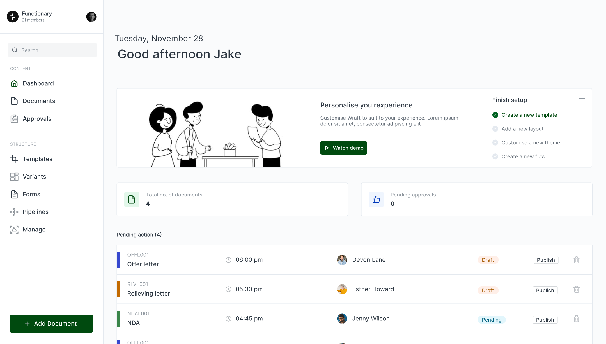

<div align="center">
  
</div>

<p align="center">
  The open-source Document Lifecycle Management platform.
</p>

<div align="center">
  
</div>

# Wraft - Document Lifecycle Management

Wraft is an open-source content authoring platform that's helps businesses produce their most important set of documents.
Wraft helps author structured business content. From official letters to contracts, and beyond.

Our goal is to give people complete control over their most important documents, from drafting to collaborating and distributing.

Wraft is built on top of open formats, using markdown and JSON. This means your content is always accessible and future-proof.

## Table of contents

- [Wraft](#wraft-docs)
- [Table of contents](#table-of-contents)
  - [Development](#development)
    - [Pre-requisite](#pre-requisite)
    - [Initial setup](#initial-setup)
  - [Running Wraft](#running-wraft-docs)
  - [Testing Wraft](#testing-wraft-docs)
  - [Others](#others)
    - [Few additional `mix tasks`](#few-additional-mix-tasks)

## Development

#### Pre-requisite

- Elixir 1.18.4
- Erlang/OTP 27.0.1
- Postgres
- Minio - S3 compatible object storage
- Pandoc 3.6.3
- ImageMagick
- Latex
- Typst 0.13.0
- Java 17 (for PDF signing)
- Rust toolchain (for native dependencies)

`.tool-versions` will have the exact versions defined in it.

#### Initial setup

### 1 - **Clone the repository**

```shell
$ git clone https://github.com/wraft/wraft.git
$ cd wraft
```

### 2 - **Elixir & Erlang**

As these 2 are defined in the `.tool_versions`, `asdf` will install the right versions with the following set of commands:

Please refer the given link for the installation of [asdf-version-manager](https://asdf-vm.com/#/core-manage-asdf-vm?id=install).

Add the following plugins to your asdf for elixir and erlang:

```shell
$ asdf plugin add erlang https://github.com/asdf-vm/asdf-erlang.git

$ asdf plugin add elixir https://github.com/asdf-vm/asdf-elixir.git
```

```shell
$ asdf install
```

⚠️ For Ubuntu users, you also need to install the inotify-tools package.

**inotify-tools**

- command-line utilities to monitor file system activity

In macOS:

```shell
$ brew install inotify-tools
```

In Linux:

```shell
$ sudo apt install inotify-tools
```

### 3 - **Postgres**

Select your OS from the options [here](https://www.postgresql.org/download/) and follow the instruction to
install the latest version of postgres.
Check your installation using:

```shell
$  postgres -V
```

Test your connectivity:

```shell
$ psql -h 127.0.0.1 -p 5432 -U postgres postgres
```

### 4 - **Minio**

Download the latest version of minio from [here](https://min.io/docs/minio/linux/index.html) and follow the instructions to install based on your OS.

Run the following command from the system terminal or shell to start a local MinIO instance using the ~/minio folder. You can replace this path with another folder path on the local machine:

```shell
$ minio server ~/minio
$ minio server ~/minio --console-address :9001
```

Open http://127.0.0.1:9000 in a web browser to access the MinIO Console.

### 5 - **Pandoc**

##### **macOS**

The easiest way to install it on OSX is via brew:

```shell
$ brew install pandoc
```

##### **Linux**

For Linux machines, follow the instructions below.

- Download the pandoc package that suits your device [here](https://github.com/jgm/pandoc/releases/tag/2.9.2.1)
- To install the deb:

```shell
$ sudo dpkg -i $DEB
```

where `$DEB` is the path to the downloaded deb.

These instructions are taken from [Official Pandoc Documentations](https://pandoc.org/installing.html).
You may refer if the official documentation if you have any doubts.

### 6 - **ImageMagick**

To use ImageMagick, install the ImageMagick distribution from [here](https://imagemagick.org/script/download.php) appropriate to your OS.

For linux:
```sh
sudo apt update
sudo apt install imagemagick
```

### 7 - **Latex**

To use Latex in OSX, install the MacTex Distribution. You can download MacTex [here](https://www.tug.org/mactex/).
Choose the correct version that supports your device, download and install. Latex editor comes with the distribution.

In Linux machines, we suggest to use Tex Live LaTeX distribution. Easiest way to install Tex Live distribution in
Linux/Ubuntu is to use `apt-get`.

```shell
$ sudo apt-get install texlive-full
```

In case you need latex editor, type in:

```shell
$ sudo apt-get install texmaker
```

### 8 - **Typesense**

Typesense is a fast, typo-tolerant search engine used by Wraft for search functionality.

Download from [Typesense releases](https://github.com/typesense/typesense/releases) or run manually:

```shell
$ mkdir -p ~/typesense-data
$ typesense-server --data-dir ~/typesense-data --api-key=your-api-key-here
```

**Note:** Replace `your-api-key-here` with a secure API key. Default port is 8108.

### 9 - Running Wraft

To start your Wraft app:

**Load env variables**

Make a .env.dev file in the root directory and add the environment variables.
Refer `.env.example` for the list of variables.

Source the environment variables from the file and start the server.

```shell
$ mv .env.example .env.dev
$ source .env.dev
```

Setup the project

```shell
$ mix setup
```

**Start Phoenix endpoint**

- With interactive shell

```shell
$ iex -S mix phx.server
```

- Without interactive shell

```shell
$ source .env.dev && mix phx.server
```

Now you can visit [`localhost:4000`](http://localhost:4000) from your browser.

To get the API documentation, go [here](http://localhost:4000/api/swagger/index.html#/).

### 10 - Frontend

Clone the frontend repository separately.

```shell
$ cd ..
$ git clone https://github.com/wraft/wraft-frontend.git
$ cd wraft-frontend
```

Refer the README.md in the frontend repository for the setup.

### 11 - Default User

The default username and password

```bash
username: wraftuser@gmail.com
password: demo@1234
```

---

## Setup using Docker

The easiest way to get started with Wraft is using Docker. The Docker setup includes all required dependencies and services.

### Prerequisites

- Docker and Docker Compose installed on your system
- Git

### Quick Start

```shell
$ git clone https://github.com/wraft/wraft.git
$ cd wraft

# Copy the example env to your own file and edit it
$ cp .env.example .env.dev

# Load the development environment variables
$ source .env.dev

# Start the Docker containers
$ docker-compose up -d

# Visit the application
$ open http://localhost:3200
```

### What's Included

The Docker setup includes:

- **Backend**: Elixir 1.18.4 with Erlang 27.0.1
- **Frontend**: React application
- **Database**: PostgreSQL 14
- **Object Storage**: MinIO (S3-compatible)
- **Search Engine**: Typesense
- **Dependencies**: Pandoc 3.6.3, Typst 0.13.0, LaTeX, ImageMagick, Java 17, Rust toolchain

#### Services and Ports

- **Frontend**: http://localhost:3200
- **Backend API**: http://localhost:4000
- **MinIO Console**: http://localhost:9001
- **PostgreSQL**: localhost:5433
- **Typesense**: localhost:8108

##### Default Credentials

```bash
username: wraftuser@gmail.com
password: demo@1234
```

##### Environment Variables

Make sure to configure the following environment variables in your `.env.dev` file:

- `SECRET_KEY_BASE`
- `DATABASE_URL`
- `MINIO_ROOT_USER` / `MINIO_ROOT_PASSWORD`
- `TYPESENSE_API_KEY`
- `CLOAK_KEY`
- `GUARDIAN_KEY`
- And other required variables (see `.env.example`)

#### Stopping the Services

```shell
$ docker-compose down
```

To remove all data volumes as well:

```shell
$ docker-compose down -v
```

## License

Wraft is open-source software licensed under the [AGPLv3](LICENSE).
